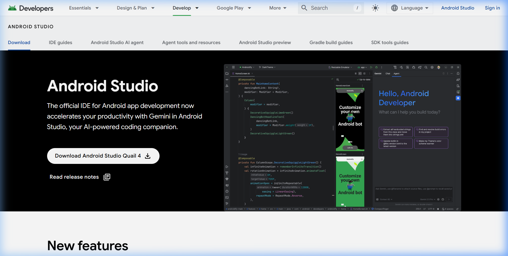
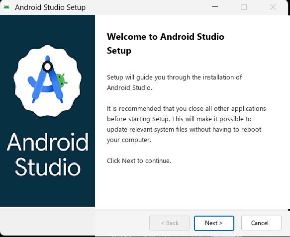
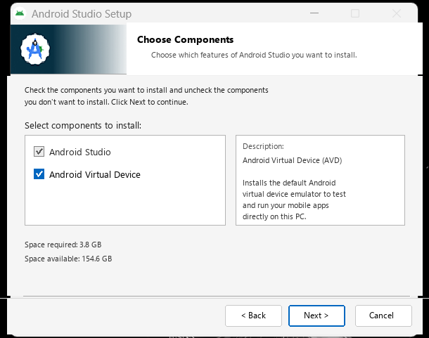
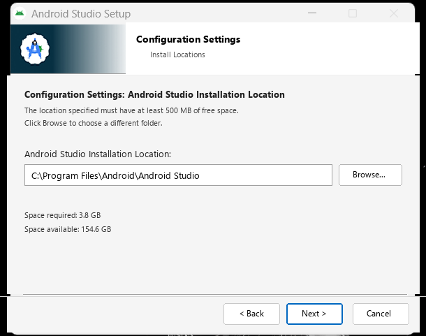

# 🛠️ Pertemuan 1: Pengenalan Android Studio & Analisis Spesifikasi Laptop

-blue?style=for-the-badge&logo=microsoftword&logoColor=white)

### Modul Praktikum Pengembangan Aplikasi Mobile (PAM)
**Muhammad Fatahillah Farid — NIM: 123140203**  
*Teknik Informatika • Institut Teknologi Sumatera (ITERA)*

---

## 📄 Berkas Laporan Resmi (Word Document)

Laporan praktikum lengkap telah disusun secara komprehensif dalam format Microsoft Word (**`.docx`**) berstandar akademik yang memuat cover formal, analisis mendalam spesifikasi hardware, 15 langkah tutorial visual dengan tangkapan layar, verifikasi pengujian Hello World, dan panduan troubleshooting:

1. 📥 **[Muhammad Fatahillah Farid_123140203_P1.docx](Muhammad%20Fatahillah%20Farid_123140203_P1.docx)** *(Format penamaan tugas resmi)*
2. 📥 **[Panduan_Instalasi_Android_Studio_dan_Spesifikasi_Laptop.docx](Panduan_Instalasi_Android_Studio_dan_Spesifikasi_Laptop.docx)** *(Salinan berkas panduan teknis)*

---

## 📊 1. Analisis Kebutuhan Spesifikasi Laptop / PC

Pengembangan aplikasi mobile Android menuntut spesifikasi perangkat keras yang memadai karena IDE menjalankan JVM IntelliJ, background indexing, server latar belakang Gradle Daemon, serta mesin virtual emulator Android AVD secara serentak.

### Tabel Komparasi Spesifikasi

| Komponen Hardware | Minimum Resmi (Google) | Rekomendasi Standar | Rekomendasi Optimal (PAM Power User) |
| :--- | :--- | :--- | :--- |
| **Sistem Operasi** | Windows 8 / 10 / 11 (64-bit) | Windows 10 / 11 (64-bit) Update Terkini | Windows 11 (64-bit) Pro / Home |
| **Processor (CPU)** | x86_64 CPU; Intel Core Gen 2 / AMD | Intel Core i5 (Gen 10+) / AMD Ryzen 5 (Min. 4 Core / 8 Thread) | Intel Core i7 (Gen 12+) / AMD Ryzen 7 (8–16 Core / Thread) |
| **Virtualisasi** | VT-x / AMD-V didukung CPU | VT-x / SVM diaktifkan di BIOS & WHPX aktif | Hardware Virtualization + Hyper-V aktif penuh |
| **RAM (Memori)** | 8 GB RAM fisik | **16 GB DDR4 / DDR5 Dual Channel** | **32 GB DDR4 / DDR5 Dual Channel** |
| **Penyimpanan (Disk)**| 8 GB ruang kosong (HDD diizinkan) | **SSD SATA / NVMe** (Min. 30 GB free) | **SSD NVMe M.2 PCIe Gen 4** (60–100 GB free) |
| **Resolusi Layar** | 1280 x 800 piksel | 1920 x 1080 piksel (Full HD 1080p) | 1920 x 1080 atau Dual Monitor |
| **Kartu Grafis (GPU)**| Integrated GPU (OpenGL 3.3) | Dedicated GPU (GTX/RTX / Radeon) | Dedicated GPU RTX 3050+ (DirectX 12/Vulkan) |
| **Koneksi Internet** | 2–5 Mbps | 10–20 Mbps (Kuota min. 5 GB) | 50+ Mbps Fiber Optic Tanpa Kuota |

### 💡 Tips Khusus untuk Laptop RAM 8 GB:
* **Gunakan Smartphone Android Fisik via USB Debugging**: Menghilangkan beban kerja emulator AVD di laptop, langsung menghemat alokasi RAM 2.5 GB – 3.5 GB!
* **Atur JVM Heap Gradle**: Tambahkan `org.gradle.jvmargs=-Xmx1536m -XX:MaxMetaspaceSize=512m` pada berkas `gradle.properties`.
* **Wajib Gunakan SSD**: Menghindari bottleneck *Disk Usage 100%* yang sering terjadi pada HDD mekanik konvensional.
* **Aktifkan Power Save Mode**: Di Android Studio melalui `File > Power Save Mode` saat mengetik kode.

---

## 📸 2. Dokumentasi 15 Langkah Instalasi & Konfigurasi

Rangkaian penginstalan terdokumentasikan secara lengkap dalam 15 langkah visual:

### Fase 1: Pengunduhan Berkas Resmi
* **Langkah 1**: Mengunduh installer resmi Android Studio Quail 4 (2026.1.4) dari `developer.android.com/studio`.  
  

### Fase 2: Pemasangan Perangkat Lunak Inti (Windows Setup Wizard)
* **Langkah 2**: Menjalankan installer dengan hak Administrator & Layar Sambutan (*Welcome to Android Studio Setup*).  
  
* **Langkah 3**: Pemilihan komponen software: Memastikan opsi **Android Studio** dan **Android Virtual Device (AVD)** tercentang.  
  
* **Langkah 4**: Konfigurasi lokasi direktori instalasi (`C:\Program Files\Android\Android Studio`).  
  
* **Langkah 5**: Proses ekstraksi berkas sistem dan font (`NotoSansCJK-Regular.ttc`).  
  
* **Langkah 6**: Instalasi software selesai & mencentang opsi *Start Android Studio*.  
  

### Fase 3: Initial Run & Setup Android SDK Toolchain
* **Langkah 7**: Splash Screen inisialisasi Android Studio Quail 4 (2026.1.4).  
  
* **Langkah 8**: Dialog telemetri dan data privasi *Help improve Android Studio* (*Don't send* / *Send usage statistics*).  
  
* **Langkah 9**: Memulai *Android Studio Setup Wizard* untuk penyiapan *development environment*.  
  
* **Langkah 10**: Pemilihan tipe instalasi: Memilih opsi **Standard** yang stabil dan direkomendasikan.  
  
* **Langkah 11**: Verifikasi pengaturan komponen SDK yang akan diunduh (SDK Platform 37.0, Build-Tools 36, Platform-Tools, Emulator ~600 MB).  
  
* **Langkah 12**: Persetujuan lisensi legal Google `android-sdk-license` (*Accept*).  
  
* **Langkah 13**: Proses pengunduhan komponen SDK dari server repositori Google `dl.google.com`.  
  
* **Langkah 14**: Log konfirmasi instalasi komponen selesai (*"Android SDK is up to date"*).  
  

### Fase 4: Dashboard Utama Siap Pakai
* **Langkah 15**: Tampilan selamat datang di Android Studio (*New Project*, *Open*, *Clone Repository*, *Customize*, *Plugins*, *Learn*).  
  

---

## 🧪 3. Verifikasi Pengujian Proyek Pertama (Hello World)

1. **Pembuatan Proyek**: Memilih template `Empty Views Activity` atau `Empty Activity (Compose)`.
2. **Konfigurasi Project**:
   * Name: `MyFirstPAMApp`
   * Package: `com.example.myfirstpamapp`
   * Language: `Kotlin`
   * Minimum SDK: `API 26 (Android 8.0 Oreo)`
   * Build Configuration: `Kotlin DSL (build.gradle.kts)`
3. **Gradle Sync**: Menunggu dependensi selesai diunduh hingga muncul status *"BUILD SUCCESSFUL"*.
4. **Execution (Run App)**: Menjalankan aplikasi ke perangkat emulator AVD atau smartphone fisik via USB Debugging.

---

## 🛠️ 4. Panduan Troubleshooting Singkat

| Permasalahan | Penyebab Utama | Solusi Tindakan |
| :--- | :--- | :--- |
| **VT-x / AMD-V Disabled** | Fitur virtualisasi CPU belum diaktifkan di BIOS | Masuk BIOS (F2/F12/Del) > Menu Advanced / CPU > Aktifkan *Intel Virtualization Technology* atau *SVM Mode*. |
| **Gradle Sync Timeout** | Koneksi internet terhalang firewall / proxy | Beralih ke Hotspot seluler pribadi, lalu klik ikon Gajah *Sync Project with Gradle Files*. |
| **SDK Path Spasi Error** | Username Windows memiliki spasi (`C:\Users\Nama User\...`) | Buka *Tools > SDK Manager* > Pindahkan direktori SDK ke path tanpa spasi seperti `C:\Android\Sdk`. |
| **Device Unauthorized** | Belum menyetujui izin USB Debugging di HP | Pada HP, buka Developer Options > Revoke USB debugging > cabut & colok ulang kabel > centang *"Always allow"* > ketuk OK. |
| **Out of Memory Error** | Heap Java kompilasi melebihi kapasitas | Buka `gradle.properties`, tambahkan: `org.gradle.jvmargs=-Xmx2048m -XX:MaxMetaspaceSize=512m`. |

---
*Dokumen Laporan Praktikum Pertemuan 1 — Muhammad Fatahillah Farid (123140203)*
